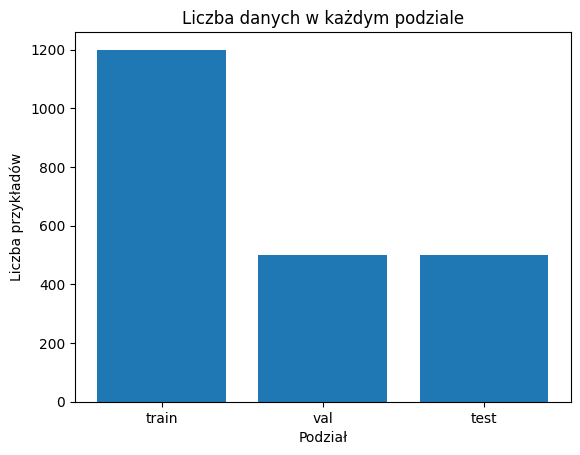
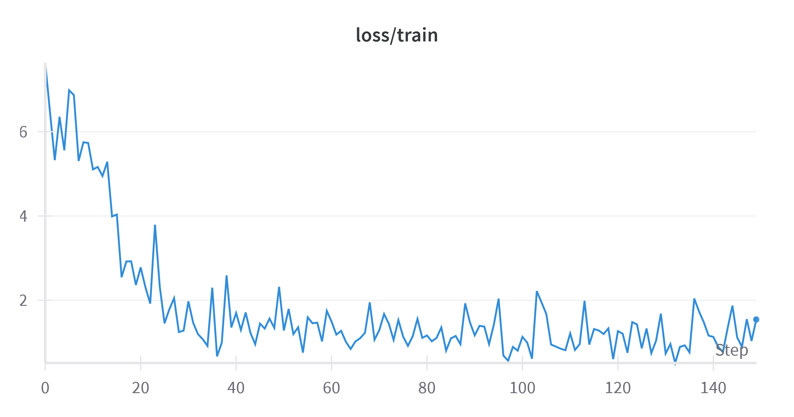
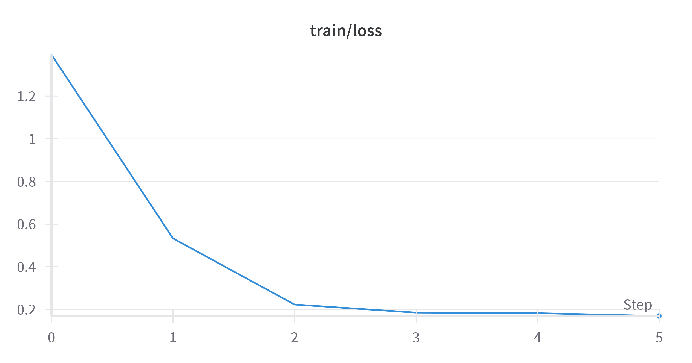
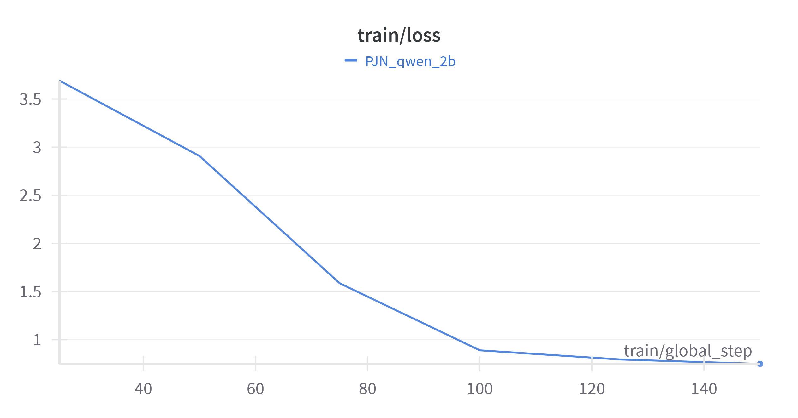

### PJN_Multimodal_Models

## Zbiór danych
Zbiór danych używany w tym projekcie to zmieniona wersja zbioru ChartQA: [ChartQA](https://huggingface.co/datasets/HuggingFaceM4/ChartQA).

Został on pomniejszony i umeszczony na HF: [PJN_CHARTS](https://huggingface.co/datasets/krowiemlekommm/PJN_CHARTS). 

Zbiór danych składa się z 3 klas: "image", "query", "label". Wszystkich przykładów jest 2200 i podzelone zostały na zbiory "train", "val", "test" o następującym rozkładzie:

## Modele
Wytrenowane modele na wyżej wymienionym zbiorze danych:

- [**Moondream2**](https://huggingface.co/vikhyatk/moondream2)
- [**SmolVLM-Base**](https://huggingface.co/HuggingFaceTB/SmolVLM-Base)
- [**Qwen2-VL-2d-Instruct**](https://huggingface.co/Qwen/Qwen2-VL-2B-Instruct)

### Moondream
- **Typ modelu**: Multimodalny (przetwarzanie obrazów i tekstu)
- **Liczba parametrów**: Dostępne warianty z 2 miliardami oraz 0,5 miliarda parametrów
- **Zastosowania**:
  - Opisywanie obrazów
  - Odpowiadanie na pytania dotyczące treści wizualnych
  - Wykrywanie obiektów

### SmolVLM-Base

- **Typ modelu**: Multimodalny (przetwarzanie obrazów i tekstu)
- **Liczba parametrów**: 2,25 miliarda
- **Architektura**: 
  - Opiera się na modelu Idefics3
  - Wykorzystuje językowy model SmolLM2
- **Zastosowania**:
  - Odpowiadanie na pytania dotyczące obrazów
  - Opisywanie treści wizualnych
  - Tworzenie opowieści na podstawie wielu obrazów
  - Funkcjonowanie jako model językowy bez wejść wizualnych
- **Optymalizacja**:
  - Lekka architektura odpowiednia do aplikacji na urządzeniach lokalnych
  - Efektywny system kompresji obrazów
    

### Qwen2-VL-2B-Instruct
- **Typ modelu**: Multimodalny (przetwarzanie obrazów, wideo i tekstu)
- **Liczba parametrów**: 2 miliardy
- **Architektura**: 
  - **Naive Dynamic Resolution**: Obsługuje obrazy o dowolnej rozdzielczości, mapując je na dynamiczną liczbę tokenów wizualnych
  - **Multimodal Rotary Position Embedding (M-ROPE)**: Dezaktywuje pozycjonowanie na części, aby uchwycić informacje pozycyjne:
    - 1D (tekst)
    - 2D (obraz)
    - 3D (wideo)
- **Zastosowania**:
  - Zaawansowane rozumienie obrazów o różnych rozdzielczościach i proporcjach
  - Rozumienie wideo do 20 minut
  - Integracja z urządzeniami mobilnymi i robotami
  - Obsługa wielu języków

### Fine-tuning
Fine-tuning został przeprowadzony na jedną epokę na zbiorze treningowym (1200 próbek).

Finetuned modele dostępne są tutaj:

- [**PJN_moondream**](https://huggingface.co/krowiemlekommm/PJN_moondream)
    -  GPU: NVIDIA L4
    -  

- [**SmolVLM**](https://huggingface.co/Szczurek/smolvlm).
    -  GPU: NVIDIA L4
    -  
 
- [**PJN_Qwen_2b**](https://huggingface.co/krowiemlekommm/PJN_qwen_2b)
    -  GPU: NVIDIA L4
    - 

### Metryki

Efektywność sprawdzona została poprzez porównanie wyników na modelu przed fine-tuningiem i po. Wykorzystaliśy do tego metryki Rouge oraz Blue i wyniekiem jest średnia wszystkich wyników wykonana na zbiorze testowym.

### SmolVLM-Base
SmolVLM zarówno na bazowym modelu jak i na naszym wyniki ma bardzo nieskie. Jednak nasz model wypada lepiej w tym porównaniu.

### Moondream
Nasz model jest dużo wolniejszy od modelu bazowego.
